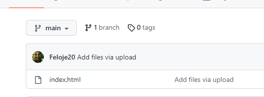
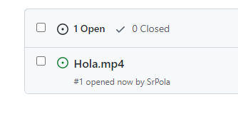
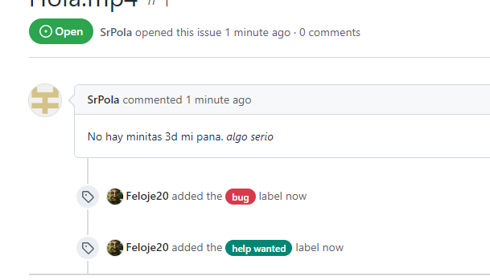
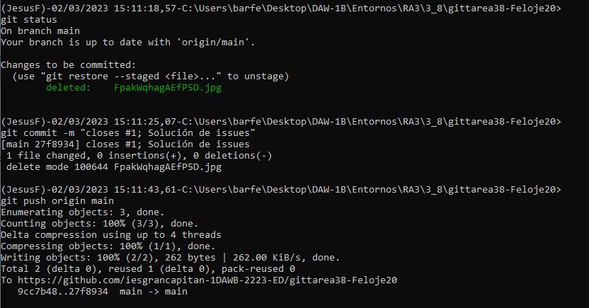
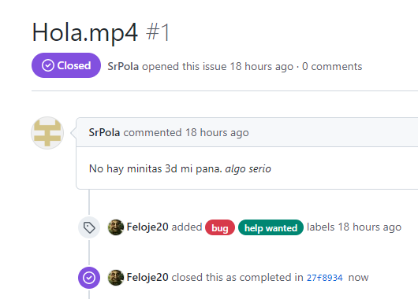

# Ejercicio 3_8

## 1
Creamos un repositorio cualquiera, y se lo pasamos a nuestro compañero.  

## 2
Nuestro compañero asignará un issue a nuestro commit. 

## 3
Nosotros asignaremos un par de etiquetas al issue, en este caso he asignado "bug" y "Help wanted". 

## 4
Para solucionar los issues, clonaremos el repo en local y trabajaremos en él para solucionar los errores. En este caso, cualquier cambio nos valdrá. Lo importante aquí será cuando hagamos el commit, pues también cerraremos los issues que hayamos solucionado. En este caso, hemos solucionado el issue número 1, por lo que usaremos "closes #1" para cerrarlo en el comando del commit. 

## 5
Como podemos comprobar, con esto ya hemos cerrado el issue que había abierto nuestro compañero. 

